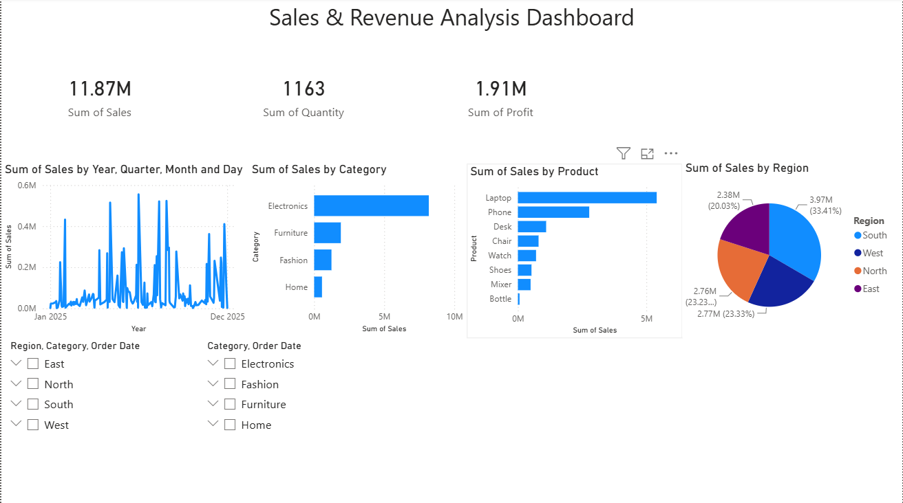

# 📊 Sales & Revenue Analysis Dashboard

## 📌 Project Overview

The **Sales & Revenue Analysis Dashboard** is an interactive Power BI project designed to analyze sales performance, revenue, profit, and product trends. The dashboard enables users to gain valuable business insights through dynamic visualizations and interactive filters.

This project demonstrates data visualization, KPI analysis, and business intelligence skills using Microsoft Power BI.

---

## 🚀 Features

- 📈 Total Sales KPI
- 💰 Total Profit KPI
- 📦 Total Quantity Sold
- 📅 Monthly Sales Trend Analysis
- 🛍️ Sales by Category
- 🌍 Sales by Region
- 🏆 Top Performing Products
- 🎛️ Interactive Slicers (Region & Category)
- 📊 Professional Dashboard Layout

---

## 🛠️ Tools & Technologies

- Microsoft Power BI
- Microsoft Excel
- Data Visualization
- Business Intelligence (BI)
- Dashboard Design

---

## 📂 Project Files

- `Sales_Revenue_Analysis_Dashboard.pbix` – Power BI Dashboard
- `Sales_Revenue_Dataset.xlsx` – Sales Dataset
- `dashboard.png` – Dashboard Screenshot
- `README.md` – Project Documentation

---

## 📷 Dashboard Preview

---

## 📊 Dashboard Insights

This dashboard helps users:

- Analyze overall sales performance
- Monitor total profit and sales quantity
- Compare sales across different product categories
- Identify top-performing products
- Analyze sales by region
- Track monthly sales trends
- Filter data dynamically using interactive slicers

---

## 📈 KPIs Included

- Total Sales
- Total Profit
- Total Quantity Sold

---

## 📌 Visualizations

- KPI Cards
- Line Chart
- Bar Chart
- Pie Chart
- Interactive Slicers

---

## 📁 Dataset

The dataset contains sales transaction records including:

- Order ID
- Order Date
- Customer
- Product
- Category
- Region
- Quantity
- Unit Price
- Sales
- Profit

---

## 🎯 Learning Outcomes

Through this project, I learned:

- Data Import and Cleaning
- Power BI Dashboard Development
- KPI Creation
- Interactive Report Design
- Business Data Analysis
- Data Visualization Best Practices

---

## 👨‍💻 Author

**Shiva Charan Palai**

GitHub: https://github.com/shivacharanpalai674-cloud

---
